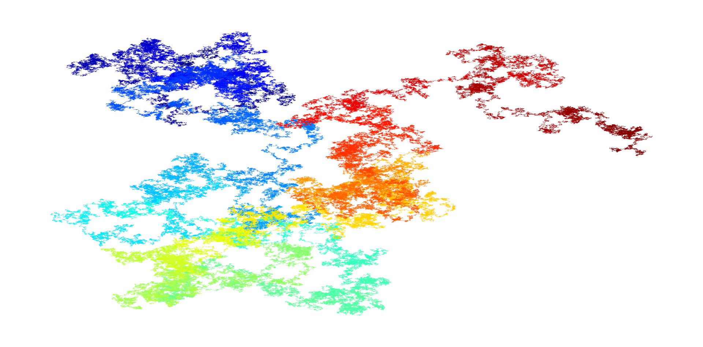

# visualizing_pi

Some time ago I saw Nadieh Bremers visualization [__The Art in pi__](https://www.visualcinnamon.com/portfolio/the-art-in-pi) implemented by using R's ggplot2.   
The visualization showes a path of line segments colored from the first digits in blue to the last digits in red. The digits of pi are represented by vectors of different direction. The idea is to have every number between 0 to 9 be a vector with endpoints evenly distributed on a circle. So we start at the origin, add the vector for the number 3, then add the vector for number 1, then 4, etc.  
As I found the idea visually and conceptually interesting I decided to code this myself in R. Using ggplot2 this is suprisingly easy and needs very little code. I have now moved to Python and this is my try on this particular visualization using Python.

